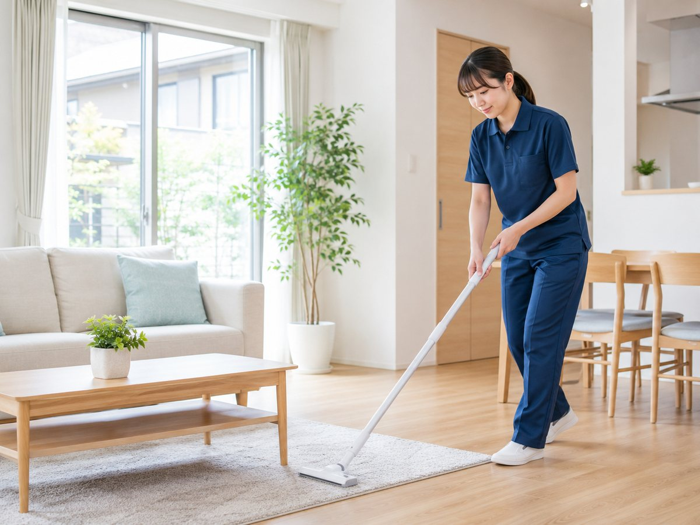
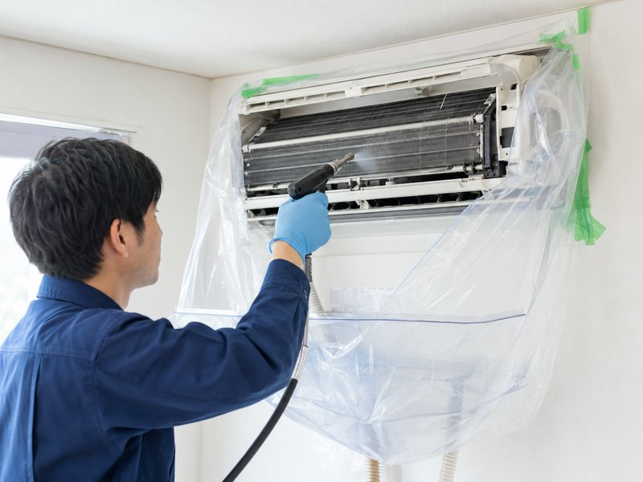

# AICHI CLEAN 集客LP｜AI画像生成プロンプト一覧（Phase 3）

**対象**：8用途／実ファイル11枚
**ステータス**：✅ **完了**（11枚すべて生成・最適化・実装済み／2026-07-29）

実装結果は `HANDOFF.md` の「Phase 4 実施結果」を参照。
元画像は `images/_source/*-original.png` に保管、配信用は `images/` に JPEG＋WebP で配置済み。
このほか、OGP用に `images/ogp.jpg`（1200×630）を `hero-main` の元画像から別途書き出している。

### Phase 4 に持ち越す確定事項（2件・ユーザー承認済み）

| # | 内容 | 決定 |
|---|---|---|
| 1 | SERVICE の「トイレ／洗面所／まるごと清掃」3カード | **画像を追加しない。** 破線プレースホルダーのままにはせず、**意図的な「画像なしカード」デザイン**へ変更する（Phase 4でHTML/CSS対応） |
| 2 | 最終CTAのオーバーレイ | **少し弱める方針。** ただし先に数値を固定せず、**実画像を入れてから白文字の可読性を見て最小限だけ調整**する。目安は `0.70〜0.82` 付近。調整後は白文字とのコントラスト比4.5:1以上を再確認する |

> BEFORE/AFTER は比較写真そのものがセクションの価値であるため、**エアコン組を削除せず2枚を追加して3組構成を維持**する（本ファイルの9・10章）。

全画像を「同じ日本の一般住宅で、同じカメラ・同じ光で撮影した写真」に見せるため、
共通スタイル定義（Style Anchor）を全プロンプトの土台にしています。
各生成ツール（ChatGPT / Midjourney / Stable Diffusion / Adobe Firefly 等）にそのまま貼り付けて使えるよう英語で記述しています。

---

## 0. 共通ビジュアルルール（Style Anchor）※全11枚で必ず使用

全画像のプロンプト冒頭に、以下のブロックを必ず含めてください。

```
Photorealistic interior photography of an ordinary modern Japanese home.
Bright, clean and airy atmosphere. Color palette of white, light blue and
pale natural wood. Soft natural daylight coming from a window, gentle
shadows, neutral white balance, slightly high-key exposure. Realistic
residential scale of a normal Japanese family house or apartment — not a
luxury mansion, not a showroom, not a hotel. Typical Japanese housing
fixtures. Shot on a DSLR, 35mm lens, f/4, sharp focus, fine detail,
natural color grading, no HDR effect, no heavy vignette, no illustration
or CGI look.
```

**日本語要約**：日本の一般的な住宅／明るく清潔で風通しのよい空気感／白・ライトブルー・淡い木目／窓からの自然光・neutralな色温度／やや明るめの露出／高級マンションやモデルルームにしない／日本の住宅設備／一眼レフで撮ったような自然な写り。

### 共通ネガティブプロンプト（対応ツールのみ）

```
text, letters, kanji, hiragana, katakana, numbers, logo, watermark,
brand name, product label, signage, packaging with readable text,
illustration, cartoon, anime, 3d render, CGI look, oversaturated colors,
dark, gloomy, moody lighting, cluttered, messy background, luxury
mansion, hotel suite, showroom, western-style house, american kitchen,
garbage disposal, carpeted bathroom, shower curtain bathtub,
distorted hands, extra fingers, malformed fingers, deformed tools,
broken cleaning equipment, floating objects, duplicated limbs,
multiple heads
```

### 全画像で守るルール（指示書より）

| ルール | 内容 |
|---|---|
| 住宅 | 日本の一般住宅。過度に高級な住宅・海外住宅特有の設備を避ける |
| 明るさ | 明るく清潔。暗い・じめじめした印象にしない |
| 配色 | 白・ライトブルー基調（サイトの `--white` / `--blue-light` と揃える） |
| 光 | 自然光。強いスポットライトや色付き照明を使わない |
| 質感 | 写真に近いフォトリアル。イラスト・CG調にしない |
| 文字 | 実在企業ロゴ・ブランド名・**読める文字を一切入れない** |
| 人物 | 不自然な手指を出さない。手を写す場合は指の本数・関節を必ず拡大確認 |
| 道具 | 清掃器具の構造破綻（ノズルが繋がっていない、ブラシが浮いている等）を避ける |

### 日本の住宅として「入れてよいもの／避けるもの」

- **入れてよい**：システムキッチン（ステンレスシンク＋ガスコンロ）、ユニットバス、壁掛けエアコン、フローリング、引き戸、白い壁紙、ベランダ窓
- **避ける**：ディスポーザー、カーペット敷きの浴室・キッチン、シャワーカーテン付き据え置きバスタブ、観音開きの巨大冷蔵庫、土足前提の玄関

### 服装（人物が写る画像で統一）

- 無地のネイビーのポロシャツ ＋ 白または淡いグレーのエプロン
- **ロゴ・刺繍・プリント一切なし**
- 手袋を着ける場合は無地のブルーまたは白のゴム手袋
- 20代後半〜40代前半、清潔感のある短髪・まとめ髪

> **1作目での失敗**：AI生成画像の作業着の胸元に社名文字が写り込み、実装直前に発覚してクロップ対応が必要になった。
> **今回は生成直後に必ず胸元・道具・パッケージを拡大確認すること。**

---

## 0-2. Before / After の生成運用（最重要）

Before と After は **同一アングル・同一構図・同一設備** でなければ比較として成立しません。
**2枚を独立に生成すると必ずズレるため、以下の手順を前提とします。**

### 手順（必ずこの順序で行う）

1. **BEFORE を先に生成する**（プロンプトは各項目に記載）
2. 気に入った BEFORE が出るまで、**BEFORE だけ**を作り直す
3. BEFORE が確定したら、**その画像を入力として AFTER を「編集」で作る**
   （ゼロから生成しない）

### ツール別の作り方

| ツール | 方法 |
|---|---|
| **ChatGPT（画像編集）** | BEFORE画像を添付し、下記の日本語指示を送る（推奨・最も手軽） |
| Stable Diffusion | img2img、denoising strength **0.35〜0.50**。強くしすぎると構図が変わる |
| Photoshop | 生成塗りつぶしで汚れ部分のみ選択して除去 |

### ChatGPT編集用の日本語指示（そのまま使用可）

```
この画像を編集してください。
カメラアングル・構図・画角・被写体の位置・照明・時間帯・写っている設備は
すべて完全に同じままにしてください。
変更するのは汚れの状態だけです。
汚れ・水垢・カビ・黒ずみ・くすみをすべて取り除き、
新品同様に清潔でぴかぴかな状態にしてください。
物を追加したり、位置を動かしたり、アングルを変えたりしないでください。
文字やロゴは入れないでください。
```

### 受け入れ基準（Before/Afterペア）

- [ ] カメラ位置・画角が一致している（左右にズレていない）
- [ ] 写っている設備・小物の**種類と位置**が一致している
- [ ] 光の向き・明るさ・色温度が一致している
- [ ] 変わっているのは**汚れの有無だけ**
- [ ] BEFOREの汚れが過度に不快でない（清潔感のあるサイトの世界観を壊さない程度）

### ⚠️ 表示サイズの制約（Before/After 6枚すべてに関わる重要事項）

BEFORE/AFTER セクションは **PC（1024px以上）で3列** になり、さらに各カード内で2枚を左右に並べます。
そのため **1枚あたりの実表示幅は約145px** しかありません（実測値：コンテナ1080px → カード341px → 内側301px → 2分割で145px）。

このサイズでは**細かいディテールの差は視認できません。** したがって：

- **面積の大きい差**（全体のくすみ ↔ 明るい艶）で違いを作る
- ピンポイントの汚れ（小さなシミ1点など）だけに頼らない
- BEFORE は「全体的にトーンが落ちて見える」、AFTER は「全体的に明るく反射する」状態を狙う
- 縮小表示して2枚を並べ、**145px幅でも差が分かるか**を必ず確認する

---

## 1. hero-main

| 項目 | 内容 |
|---|---|
| **ファイル名** | `hero-main.webp` / `hero-main.jpg` |
| **使用場所** | SECTION 01 HERO 右カラム（`index.html` 74行目 `.img-slot--hero`） |
| **比率・最終サイズ** | 4:3 ／ **1200×900px** |
| **画像の目的** | ファーストビューで「何のサービスか」を3秒で伝える。サイトで最も重要な1枚。**清掃作業そのもの**より「明るい家＋プロが手をかけている」空気感を優先する |

### プロンプト（Style Anchor ＋ 以下を追加）

```
A professional house cleaning staff member wiping down a kitchen
countertop in a bright, ordinary Japanese home. The person wears a plain
navy polo shirt and a plain white apron with absolutely no logo, no
print and no embroidery, and plain light blue rubber gloves. Calm,
focused, friendly expression, viewed from a slight three-quarter angle,
upper body visible. Behind them, a clean Japanese living-dining room
with a large window letting in soft daylight, pale wooden flooring, and
a white wall. Horizontal 4:3 composition, the person positioned slightly
right of centre, comfortable open space around them.
```

### 禁止事項（共通ネガティブに加えて）

- エプロン・シャツへのロゴ／刺繍／プリント（**最重要**）
- 洗剤ボトルのラベル文字（無地のボトルにする）
- 顔が画面端で切れる構図
- 人物が2人以上写る（HEROは1人に絞る）

### 実装時の注意点

- `.img-slot--hero` は `aspect-ratio: 4/3` ＋ `border-radius: var(--radius-lg)`（24px）。**角丸で四隅が削れるため、四隅に重要な被写体を置かない**
- PC（1024px以上）では左テキスト＋右画像の左右分割。**右カラム幅は1280px以上で約504px**なので、細部が潰れない構図にする
- Pillowで**先に4:3へクロップ**しておけば、CSS側は `object-fit: cover` のみで済む（`object-position` の調整不要）
- HEROは above the fold のため `loading="eager"` ＋ `fetchpriority="high"` を付ける（他の画像は `lazy`）

---

## 2. service-aircon

| 項目 | 内容 |
|---|---|
| **ファイル名** | `service-aircon.webp` / `.jpg` |
| **使用場所** | SECTION 05 SERVICE 1枚目（`index.html` 161行目） |
| **比率・最終サイズ** | 4:3 ／ **800×600px** |
| **画像の目的** | 「エアコン内部まで洗浄する」という、自分では手が届かない作業であることを一目で伝える |

### プロンプト

```
Close-to-medium shot of a wall-mounted split air conditioner in an
ordinary Japanese room being cleaned by a professional. The front panel
is open, revealing the internal fins. A pair of hands in plain light
blue rubber gloves is carefully wiping the interior with a clean cloth.
A plain protective sheet hangs below the unit to catch water. The wall
is plain white, soft daylight from the side. Horizontal 4:3 composition,
the air conditioner unit filling most of the frame, shot from slightly
below at a natural angle.
```

### 禁止事項

- エアコン本体のメーカーロゴ・型番表示
- リモコンの液晶表示（文字が出るため写さない）
- 手指の破綻（**指が写る画像のため必ず拡大確認**）
- ホースやノズルが途中で途切れている等の構造破綻

### 実装時の注意点

- `.service-card .img-slot` は `margin-bottom: 16px`、カード内は角丸16px
- **PCで3列**（1024px以上）になるため、1枚あたりの表示幅は約330px。細かすぎるディテールは潰れる
- 3枚（aircon / kitchen / bath）は**並んで表示される**ため、**明るさ・色温度を揃える**こと。1枚だけ暗いと目立つ

---

## 3. service-kitchen

| 項目 | 内容 |
|---|---|
| **ファイル名** | `service-kitchen.webp` / `.jpg` |
| **使用場所** | SECTION 05 SERVICE 2枚目（`index.html` 169行目） |
| **比率・最終サイズ** | 4:3 ／ **800×600px** |
| **画像の目的** | 「コンロ・シンク・換気扇まわりの油汚れ」を扱うことを伝える |

### プロンプト

```
Close-to-medium shot of a Japanese system kitchen being cleaned. A pair
of hands in plain light blue rubber gloves scrubs a stainless steel gas
cooktop with a sponge. A plain unlabeled white spray bottle stands
nearby. The kitchen has a stainless steel sink, white cabinet doors and
a simple range hood above. Bright soft daylight, clean white and light
blue tones. Horizontal 4:3 composition, shot from a slightly elevated
angle looking down at the work surface.
```

### 禁止事項

- スプレーボトル・洗剤容器のラベル文字（**必ず無地**）
- 家電（炊飯器・電子レンジ等）のブランドロゴ
- ディスポーザー、アメリカ式の大型オーブン
- 手指の破綻

### 実装時の注意点

- 上記2と同様、SERVICE3枚でトーンを揃える
- **同じキッチンを `ba-kitchen-before/after` でも使うと世界観が繋がる**が、必須ではない。揃える場合は同じ生成セッションで作る

---

## 4. service-bath

| 項目 | 内容 |
|---|---|
| **ファイル名** | `service-bath.webp` / `.jpg` |
| **使用場所** | SECTION 05 SERVICE 3枚目（`index.html` 177行目） |
| **比率・最終サイズ** | 4:3 ／ **800×600px** |
| **画像の目的** | 「水垢・皮脂汚れ・カビ」を扱うことを伝える。清潔感を損なわない見せ方にする |

### プロンプト

```
Close-to-medium shot of a Japanese unit bathroom being cleaned. A pair
of hands in plain light blue rubber gloves scrubs the wall panel with a
cleaning brush. The bathroom has typical Japanese unit-bath panels in
white and pale beige, a wall-mounted shower head on a slide bar, and a
plain white bathtub edge visible. Bright, well-lit, fresh atmosphere,
water droplets on the surface. Horizontal 4:3 composition.
```

### 禁止事項

- シャワーカーテン付きの据え置きバスタブ（海外仕様）
- カーペット敷きの床
- シャンプーボトル等のラベル文字
- 暗く狭い、じめじめした印象
- 手指の破綻

### 実装時の注意点

- 浴室は暗くなりやすい。**明示的に「bright, well-lit」を効かせ、他2枚と明るさを揃える**
- SERVICE3枚並びで色温度がずれやすいので、生成後に3枚並べて比較する

---

## 5. ba-kitchen-before

| 項目 | 内容 |
|---|---|
| **ファイル名** | `ba-kitchen-before.webp` / `.jpg` |
| **使用場所** | SECTION 07 BEFORE/AFTER キッチン組 左（`index.html` 253行目） |
| **比率・最終サイズ** | 4:3 ／ **800×600px** |
| **画像の目的** | 清掃前の状態。**次の `ba-kitchen-after` の生成元になる最重要カット** |

### プロンプト（これを先に生成する）

```
Photograph of a Japanese kitchen sink area before cleaning. A stainless
steel sink and gas cooktop with visible everyday grime: dull cloudy
stainless surface, white limescale around the faucet base, light brown
grease film on the cooktop, water spots on the counter. No garbage, no
food waste, no trash — just accumulated dirt on the surfaces. Empty
counter with nothing placed on it. Plain white cabinet doors. Even soft
daylight from the left. Horizontal 4:3 composition, shot straight on at
counter height, sink positioned in the centre of the frame.
```

### 禁止事項

- 生ゴミ・食べ残し・虫（不快感を与える要素は入れない）
- 汚れの誇張（黒く汚しすぎない。**「よくある生活汚れ」の範囲に留める**）
- カウンター上の小物（AFTERで位置がズレる原因になるため**何も置かない**）
- ラベルのある洗剤・調味料

### 実装時の注意点

- **カウンターに物を置かないこと**が同一構図を保つ最大のコツ。物が多いほどAFTERでズレる
- 「shot straight on」「centre of the frame」を必ず入れ、再現しやすい構図にする
- この画像が確定してから AFTER に進む（**同時生成しない**）

---

## 6. ba-kitchen-after

| 項目 | 内容 |
|---|---|
| **ファイル名** | `ba-kitchen-after.webp` / `.jpg` |
| **使用場所** | SECTION 07 BEFORE/AFTER キッチン組 右（`index.html` 259行目） |
| **比率・最終サイズ** | 4:3 ／ **800×600px** |
| **画像の目的** | 清掃後の状態。**BEFOREとの差が「汚れの有無だけ」であること**が価値 |

### 生成方法（ゼロから生成しない）

`ba-kitchen-before` を入力画像として、**0-2章のChatGPT編集用の日本語指示**をそのまま使用してください。

英語ツールを使う場合の img2img プロンプト（denoising strength 0.35〜0.50）：

```
The exact same kitchen, the exact same camera angle, the exact same
lighting and the exact same fixtures as the input image. Only the dirt
is removed. The stainless steel sink and cooktop are spotlessly clean
and shining, the faucet is free of limescale and reflects light, the
counter is spotless. Nothing is moved, added or removed. Photorealistic.
```

### 禁止事項

- アングル・画角・設備の変更（**これが起きたら不採用**）
- 物の追加（花瓶・タオル・食器などを足さない）
- 過度な光沢（CG的なピカピカにしない）
- 文字・ロゴ

### 実装時の注意点

- **BEFOREと必ず同じ4:3クロップ範囲で書き出す。** 片方だけトリミングすると比較が破綻する
- 並べて表示されるため、**書き出し後に2枚を左右に並べて目視確認**する
- `.img-slot--ba` は角丸8px。上下に `BEFORE` / `AFTER` の文字ラベルが付く（色だけに依存しない設計のため、画像内に文字を焼き込む必要はない）

---

## 7. ba-bath-before

| 項目 | 内容 |
|---|---|
| **ファイル名** | `ba-bath-before.webp` / `.jpg` |
| **使用場所** | SECTION 07 BEFORE/AFTER 浴室組 左（`index.html` 271行目） |
| **比率・最終サイズ** | 4:3 ／ **800×600px** |
| **画像の目的** | 清掃前の浴室。`ba-bath-after` の生成元 |

### プロンプト（これを先に生成する）

```
Photograph of a corner of a Japanese unit bathroom before cleaning.
White and pale beige wall panels meeting a plain bathroom floor, with
visible everyday grime: pale pink mould in the corner joints, white
soap scum and limescale film on the wall panel and floor, dull cloudy
surfaces. Moderate realistic dirt, not extreme. No items, no bottles,
no towels anywhere in frame. Even bright light. Horizontal 4:3
composition, shot straight on at a fixed angle, the corner where wall
meets floor positioned in the centre of the frame.
```

### 禁止事項

- 黒カビの過度な表現（**不快になりすぎない範囲に留める**）
- シャンプーボトル・洗面器などの小物（AFTERでズレる原因）
- 排水口のアップ（生理的に嫌悪感が出やすい）
- 暗い・じめじめした照明

### 実装時の注意点

- キッチンと同じく **フレーム内に物を置かない**
- 「shot straight on at a fixed angle」を必ず入れる
- 確定後に AFTER へ進む

---

## 8. ba-bath-after

| 項目 | 内容 |
|---|---|
| **ファイル名** | `ba-bath-after.webp` / `.jpg` |
| **使用場所** | SECTION 07 BEFORE/AFTER 浴室組 右（`index.html` 277行目） |
| **比率・最終サイズ** | 4:3 ／ **800×600px** |
| **画像の目的** | 清掃後の浴室。BEFOREとの差が汚れの有無だけであること |

### 生成方法（ゼロから生成しない）

`ba-bath-before` を入力画像として、**0-2章のChatGPT編集用の日本語指示**をそのまま使用してください。

img2img プロンプト（denoising strength 0.35〜0.50）：

```
The exact same bathroom corner, the exact same camera angle, the exact
same lighting and the exact same panels as the input image. Only the
dirt is removed. The mould in the joints is gone, the soap scum and
limescale are gone, the wall panels and floor are spotlessly clean and
fresh. Nothing is moved, added or removed. Photorealistic.
```

### 禁止事項

- アングル・設備の変更
- 物の追加
- 濡れた光沢の付けすぎ（水滴だらけにしない）
- 文字・ロゴ

### 実装時の注意点

- 6と同様、**BEFOREと同一のクロップ範囲**で書き出す
- 4枚（キッチンBefore/After・浴室Before/After）が同一セクションに並ぶため、**4枚のトーンを揃える**

---

## 9. ba-aircon-before

| 項目 | 内容 |
|---|---|
| **ファイル名** | `ba-aircon-before.webp` / `.jpg` |
| **使用場所** | SECTION 07 BEFORE/AFTER エアコン組 左（`index.html` 289行目） |
| **比率・最終サイズ** | 4:3 ／ **800×600px** |
| **画像の目的** | 清掃前のエアコン内部。`ba-aircon-after` の生成元。**「自分では絶対に掃除できない場所」を示す、3組の中で最も訴求力が高いカット** |

### プロンプト（これを先に生成する）

```
Photograph of the inside of a wall-mounted split air conditioner in an
ordinary Japanese room, before cleaning. The front panel is open and the
aluminium heat-exchanger fins and the cylindrical blower fan are clearly
visible. The fins and fan are covered with an even layer of grey dust
and dull grime, giving the whole interior a uniformly darkened, dusty
appearance. Moderate realistic dust, not extreme, no thick black mould
clusters. No hands, no people, no tools anywhere in frame. Plain white
wall around the unit. Even soft daylight from the side. Horizontal 4:3
composition, shot straight on from directly in front of the unit, the
open air conditioner filling most of the frame.
```

### 禁止事項

- **手・人物・道具を写さない**（AFTERで位置がズレる最大の原因になる）
- 分厚い黒カビの塊（不快感が強すぎる。**「全体的に埃をかぶって暗い」表現に留める**）
- メーカーロゴ・型番・ルーバーの印字
- 虫・汚水の垂れ
- 斜めからの見上げ構図（**正面固定**にすること）

### 実装時の注意点

- **正面固定・手なし・物なし**が同一構図を保つ条件。3組の中で最も再現しやすい構図なので、ここは確実に揃えられる
- 145px幅でも差が出るよう、**「フィン全体が均一に暗い」→「フィン全体が明るく金属光沢」**という面での差を作る
- SERVICE の `service-aircon` と**同じ機種・同じ壁**に見えるようにすると、サイト全体の統一感が上がる（必須ではない）
- この画像が確定してから AFTER に進む（**同時生成しない**）

---

## 10. ba-aircon-after

| 項目 | 内容 |
|---|---|
| **ファイル名** | `ba-aircon-after.webp` / `.jpg` |
| **使用場所** | SECTION 07 BEFORE/AFTER エアコン組 右（`index.html` 295行目） |
| **比率・最終サイズ** | 4:3 ／ **800×600px** |
| **画像の目的** | 清掃後のエアコン内部。BEFOREとの差が「汚れの有無だけ」であること |

### 生成方法（ゼロから生成しない）

`ba-aircon-before` を入力画像として、**0-2章のChatGPT編集用の日本語指示**をそのまま使用してください。

img2img プロンプト（denoising strength 0.35〜0.50）：

```
The exact same air conditioner, the exact same camera angle, the exact
same open front panel and the exact same lighting as the input image.
Only the dirt is removed. The aluminium fins and the blower fan are
spotlessly clean, free of dust and grime, showing clean bright metal
with a natural sheen. Nothing is moved, added or removed. No hands, no
people, no tools. Photorealistic.
```

### 禁止事項

- アングル・画角・機種の変更（**これが起きたら不採用**）
- 手・人物・道具の追加
- 非現実的な鏡面反射（新品のCG的な質感にしない）
- 文字・ロゴ

### 実装時の注意点

- **BEFOREと必ず同じ4:3クロップ範囲で書き出す**
- BEFORE/AFTER は全**6枚**が同一セクションに並ぶため、**キッチン組・浴室組・エアコン組の3組でトーンを揃える**
- 書き出し後、**6枚を並べて目視確認**する（1組だけ明るさが違うと目立つ）

---

## 11. final-cta-bg

| 項目 | 内容 |
|---|---|
| **ファイル名** | `final-cta-bg.webp` / `.jpg` |
| **使用場所** | SECTION 12 FINAL CTA 背景（`index.html` 482行目 `.img-slot--bg`） |
| **比率・最終サイズ** | 2:1 ／ **1600×800px** |
| **画像の目的** | 最後の後押しの背景。**濃いネイビーのオーバーレイが乗るため、主役は文字。画像は「清潔な家の気配」を出す脇役** |

### プロンプト

```
Wide horizontal photograph of a bright, clean and tidy Japanese living
room after cleaning. Pale wooden flooring, white walls, a large window
with soft daylight streaming in, a simple sofa and a low table, a few
green plants. Spacious, airy and uncluttered. No people, or optionally
one cleaning staff member in a plain navy polo shirt far in the
background. Wide panoramic 2:1 composition with generous open space in
the centre and upper half of the frame for text overlay.
```

### 禁止事項

- 中央に強い被写体を置く（**文字が乗るため中央は空ける**）
- 暗い・コントラストの強い画像（オーバーレイと合わせて潰れる）
- 細かい模様や柄の多い床・壁（オーバーレイ越しにノイズに見える）
- 文字・ロゴ

### 実装時の注意点（**重要**）

- `.final-cta__bg` は `position: absolute; inset: 0`。**`.img-slot--bg` は `aspect-ratio: auto; height: 100%`** なので、置き換える `` には `width:100%; height:100%; object-fit:cover` が必須
- **オーバーレイは Phase 4 で弱める（方針確定済み）**：
  ```css
  /* 現状（このままだと画像がほぼ見えない） */
  .final-cta__overlay {
    background: linear-gradient(180deg, rgba(15,53,87,0.86) 0%, rgba(10,40,65,0.92) 100%);
  }
  ```
  **先に数値を決め打ちせず、実画像を入れてから白文字の可読性を見て最小限だけ下げる。**
  目安は `0.70〜0.82` 付近。調整後は必ず以下を確認する：
  - 白見出し・白サブコピーが背景写真の明るい部分でも読めるか（目視）
  - 背景の最も明るい画素に対しても白文字のコントラスト比が **4.5:1 以上**か
  - オレンジのCTAボタンが背景に埋もれていないか
- 2:1のため、縦に潰れる幅（モバイル）では上下が大きくクロップされる。**上下端に重要な要素を置かない**

---

## 12. 受け入れチェックリスト（11枚すべてに適用）

生成した各画像について、**実装前に**以下を確認してください。

- [ ] 読める文字・ロゴ・ブランド名・型番が写り込んでいない（**胸元・道具・ボトル・家電を拡大して確認**）
- [ ] 手指の本数・関節が自然（手が写る画像は必ず拡大）
- [ ] 清掃器具の構造が破綻していない
- [ ] 日本の一般住宅として不自然な設備がない
- [ ] 明るく清潔で、白・ライトブルー基調に収まっている
- [ ] 他の画像と明るさ・彩度・色温度が大きくずれていない
- [ ] 過度に高級な住宅・モデルルームに見えない
- [ ] 指定のアスペクト比で主要被写体が切れない
- [ ] （Before/Afterのみ）アングル・構図・設備が完全に一致し、差分が汚れだけ

---

## 13. 最適化・実装手順（Phase 4で実行）

### 手順

1. 元画像を `images/_source/<name>-original.png` としてバックアップ（`.gitignore` で公開対象外）
2. Pillowで**先に指定比率へクロップ**してからリサイズ（CSS側の `object-position` 調整が不要になる）
3. JPEG（quality 84）＋ WebP（quality 82）の2形式で書き出し
4. `<div class="img-slot ...">` を `<picture>` に置き換え、`img-slot--photo` 相当のクラスで破線ボーダーと背景を解除

### 最適化スクリプト（1作目で実績のある設定）

```python
from PIL import Image

im = Image.open(src).convert('RGB')

# 先に目標比率へクロップしてからリサイズする
target_w, target_h = 800, 600          # 画像ごとに変更
ratio = target_w / target_h
w, h = im.size
if w / h > ratio:                       # 横に長い → 左右を削る
    new_w = int(h * ratio)
    box = ((w - new_w) // 2, 0, (w - new_w) // 2 + new_w, h)
else:                                   # 縦に長い → 上下を削る
    new_h = int(w / ratio)
    box = (0, (h - new_h) // 2, w, (h - new_h) // 2 + new_h)

im = im.crop(box).resize((target_w, target_h), Image.LANCZOS)
im.save(f'images/{name}.jpg', 'JPEG', quality=84, optimize=True, progressive=True)
im.save(f'images/{name}.webp', 'WEBP', quality=82, method=6)
```

### HTML実装パターン

```html
<!-- HERO：above the fold のため優先読み込み -->
<picture>
  <source srcset="images/hero-main.webp" type="image/webp">
  
</picture>

<!-- それ以外：遅延読み込み -->
<picture>
  <source srcset="images/service-aircon.webp" type="image/webp">
  
</picture>
```

### サイズの目安

| ファイル | 枚数 | 最終サイズ | 想定容量（WebP） |
|---|---|---|---|
| `hero-main` | 1 | 1200×900 | 80〜130KB |
| `service-aircon` / `-kitchen` / `-bath` | 3 | 800×600 | 各 40〜70KB |
| `ba-kitchen-before` / `-after` | 2 | 800×600 | 各 40〜70KB |
| `ba-bath-before` / `-after` | 2 | 800×600 | 各 40〜70KB |
| `ba-aircon-before` / `-after` | 2 | 800×600 | 各 40〜70KB |
| `final-cta-bg` | 1 | 1600×800 | 90〜150KB |
| **合計** | **11** | — | **550〜900KB程度** |

（参考：1作目は12枚でWebP計720KB）
